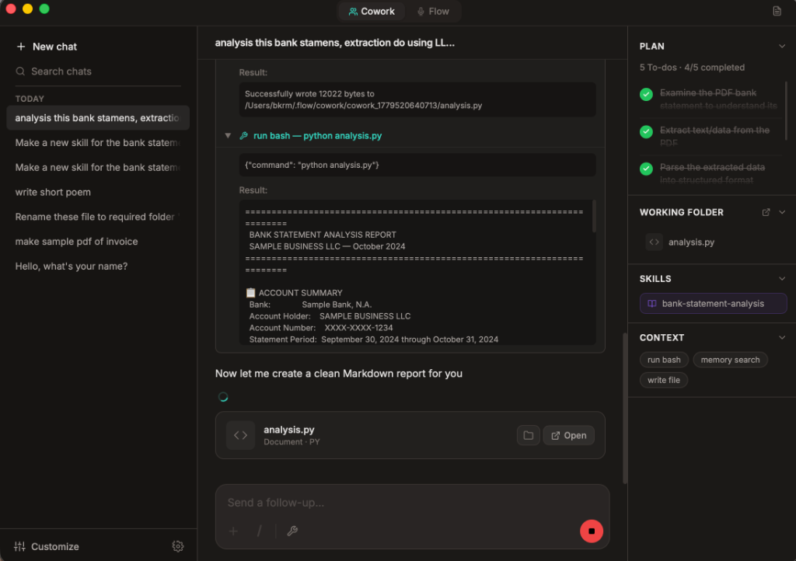
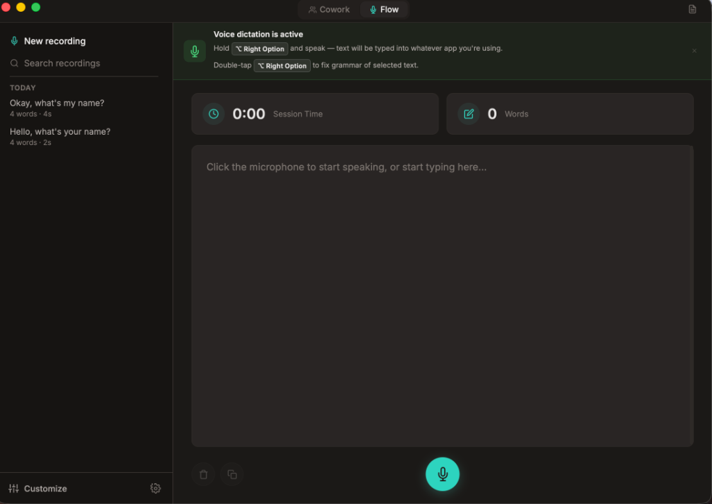
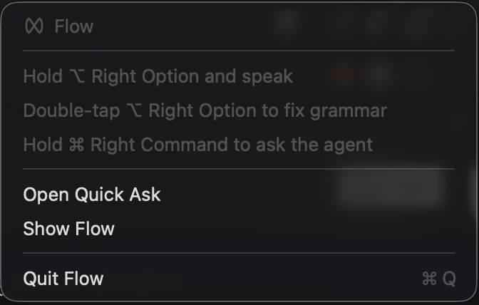
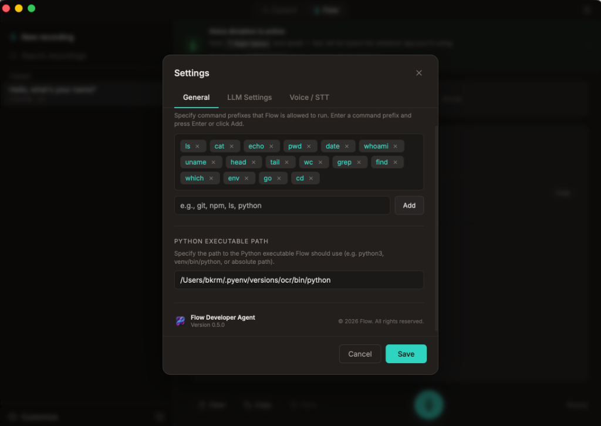
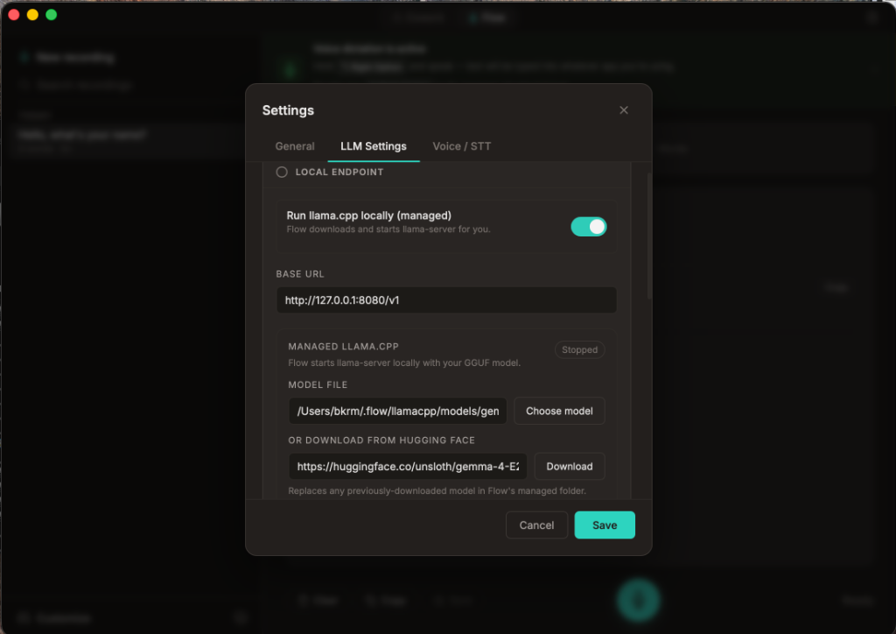
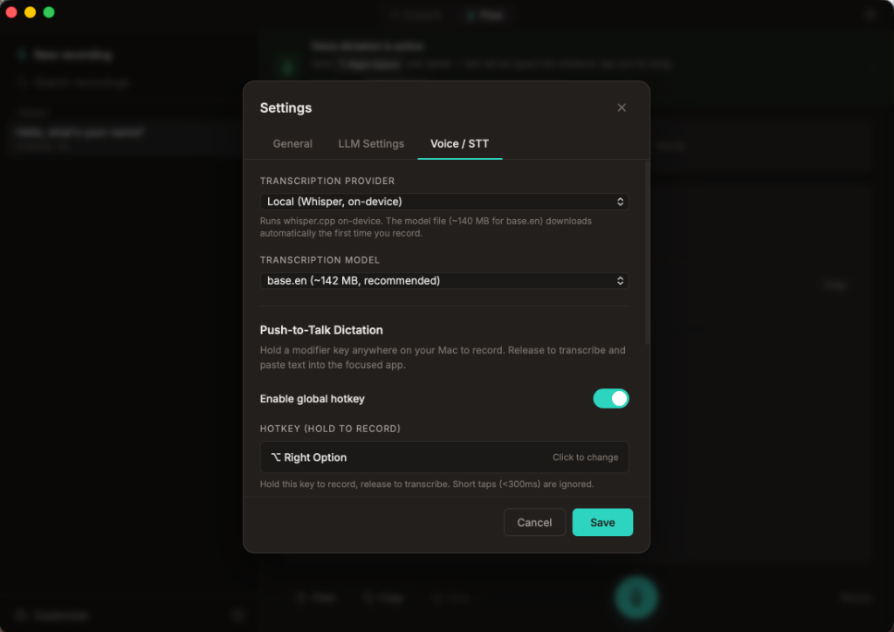

<p align="center">
  
</p>

<h1 align="center">Flow</h1>

<p align="center">
  <strong>The Ultimate Native AI Copilot & Voice Dictation Workspace for macOS</strong>
</p>

<p align="center">
  <a href="https://github.com/BkrmDahal/flow/releases/download/v0.6.0/Flow-Installer.dmg">
    
  </a>
</p>

<p align="center">
  Built with Go + Svelte via Wails, <strong>Flow</strong> is native desktop command center that seamlessly fuses a multi-turn agentic AI chat workspace (<strong>Cowork</strong>) and instantaneous, push-to-talk disfluency-free dictation refinement (<strong>Flow</strong>) directly into your daily macOS workflow. Run it completely locally using Whisper and any local model, or add cloud LLM keys.
</p>

---


## 🖥️ Visual Preview

### 🤖 Cowork — AI Agent Workspace
A powerful, multi-turn chat workspace powered by LLMs with robust agentic tool-calling capabilities. Check live execution blocks, run custom bash analysis, view auto-refinement states, load skills, and track step-by-step progress via the interactive Todo checklist panel:
<p align="center">
  
</p>

### 🎙️ Flow — Voice Recorder & Refiner
A sleek, premium dark-themed dictation workspace showing real-time audio statistics, live word counters, inline transcript editing, and instant LLM-powered refinement actions:
<p align="center">
  
</p>

### 🍏 Native Menu Bar Integration
Pinwheel-based status bar widget showing status (idle, recording, or transcribing) and quick commands:
<p align="center">
  
</p>

### ⚙️ Premium Settings & Customization
<p align="center">
  <table border="0" cellpadding="5" cellspacing="5" width="100%">
    <tr>
      <th align="center" width="50%">💻 General & Bash Approvals</th>
      <th align="center" width="50%">🦙 Local LLM (llama.cpp)</th>
    </tr>
    <tr>
      <td valign="top" align="center">
        
        <br/><em>Configure allowed commands and Python executable paths</em>
      </td>
      <td valign="top" align="center">
        
        <br/><em>Manage local llama.cpp server and download GGUF models</em>
      </td>
    </tr>
    <tr>
      <th align="center" colspan="2" style="padding-top: 15px;">🎙️ Voice & Transcription Settings</th>
    </tr>
    <tr>
      <td align="center" colspan="2">
        
        <br/><em>Select transcription provider (on-device/cloud) and set global hotkeys</em>
      </td>
    </tr>
  </table>
</p>

---

## ✨ Features

### 🤖 Cowork — AI Agent Workspace
A full-featured, multi-turn chat workspace powered by LLMs with agentic tool-calling capabilities:
- **Streaming responses** with live token rendering and smooth fading sidebar text overflow.
- **File attachments** — upload images, PDFs, CSVs, and text documents directly into the conversation.
- **Agent Planning & Todo List** — multi-step planning loops with `todo_write` integration for robust execution.
- **Structured System Prompt** — Pi-inspired composable prompt builder that dynamically injects identity, environment context (date, OS, working directory, Python path), tool guidance, safety guardrails, and mode-specific instructions.
- **Dynamic Tool use** — the agent can autonomously:
  - Read, write, and create files (`file_read`, `file_write`)
  - Execute shell commands with sandboxed approval (`command`)
  - Plan and track multi-step work via a todo list (`todo_write`)
  - Capture screenshots (`screen_capture`)
  - Search the web (`web_search`, `web_read`)
  - Persist key facts across sessions (`memory_read`, `memory_write`)
  - Load custom skills into context (`skill_load`)
- **Session management** — create, list, load, and delete chat sessions with responsive UI layout.
- **Customizable system prompt** — edit the base prompt directly from the Toolkit UI (or via `~/.flow/system_prompt.md`). Tool guidance, planning rules, safety guardrails, and environment context are automatically composed on every turn.
- **Smart output truncation** — head+tail pattern (4KB) ensures the agent sees both the start and end of long tool outputs.

### 🎙️ Flow — Voice Recorder & Transcript Refiner
Record voice notes and transcribe them with configurable speech-to-text providers:
- **One-click record/stop** with high-quality audio capture (M4A) and real-time listening indicators.
- **Text & Voice Switching** — flexible input interface allowing you to toggle between typing directly into the transcript area or using the microphone to capture voice.
- **Inline Editing with Auto-Save** — modify transcriptions directly in the viewport; edits are auto-saved on-blur to ensure a friction-free experience.
- **Local STT** — bundled `whisper.cpp` (fully offline, no API key required).
- **Cloud STT** — OpenAI Whisper, Deepgram.
- **Transcript refinement** via LLM (streaming):
  - **Clean** — fix grammar, punctuation, and disfluencies
  - **Summarize** — condense to 2-3 sentences
  - **Bullet points** — extract key points
  - **Custom prompt** — your own instruction
- **Auto-refine on stop** — optionally refine every transcript automatically after recording.
- **Transcript library** — save, browse, search, and delete past transcriptions.

### ⌨️ System-wide Dictation & Text Processing
- **Global hotkey** (configurable modifier) for instant dictation from any app.
- **Double-tap hotkey** — grabs selected text and fixes grammar/spelling via LLM.
- **Native macOS overlay** — visual recording indicator with live status.
- **Menu bar icon** — pinwheel status indicator (idle / recording / transcribing).

### 🧩 Reusable Skills & Snippets
- **Skills** — reusable instruction sets the agent can load into context at runtime to guide specialized behaviors (customizable via the Toolkit).
- **Snippets** — trigger/expansion text replacements applied to transcriptions.
- Full CRUD from the Settings/Toolkit UI.

### 🦙 Local LLM Support (llama.cpp)
- **Managed llama-server** — Flow can download, start, and stop a local llama.cpp inference server.
- **One-click GGUF download** from Hugging Face with progress tracking.
- **Model picker** — native file dialog for local `.gguf` files.
- Auto-detection of served models via `/v1/models`.

### ☁️ Multi-Provider LLM Support
- **Local / OpenAI-compatible** — LM Studio, Ollama, llama.cpp, or any `/v1/chat/completions` endpoint.
- **Anthropic** (Claude).
- **OpenAI** (GPT-4o, etc.).
- **Google Gemini**.
- **OpenRouter**.
- **Custom cloud endpoint** with configurable base URL + API key.
- Automatic provider fallback: primary → fallback → legacy agent config.

### 🛡️ Security & Permissions Guardrails
- **Accessibility & Screen Recording Permissions** — Checked and requested natively on macOS with user warnings.
- **Microphone Permissions Warning Bar** — Displays a clear visual warning banner if microphone access is denied or restricted, with a manual trigger to Open System Settings to resolve.
- **Sandboxed Command Execution** — Shell commands run by the agent require **explicit user approval** via a frontend dialog.
- Configurable **allow/block lists** persisted in `~/.flow/exec-approvals.json` (Blocked patterns are automatically denied; allowed patterns are auto-approved).

---

## 🏗️ Architecture

```
flow/
├── main.go                    # Wails app entry point
├── wails.json                 # Wails project configuration
├── flow.sh                    # Dev, build, DMG, sign, and utility CLI
├── dequarantine.sh            # macOS Gatekeeper quarantine removal
│
├── docs/                      # Project documentation and assets
│   └── images/                # Visual screenshots and UI preview gallery
│
├── backend/                   # Go backend (Wails-bound)
│   ├── app.go                 # App struct, Startup/Shutdown lifecycle
│   ├── agentapp.go            # Cowork streaming & session CRUD
│   ├── flow.go                # Voice recording, transcription, transcript CRUD
│   ├── flow_refine.go         # LLM-powered transcript refinement (streaming)
│   ├── dictation.go           # System-wide dictation hotkey setup
│   ├── settings.go            # Settings load/save, LLM client management
│   ├── models.go              # OpenAI-compatible /v1/models listing
│   ├── llama.go               # Managed llama.cpp server + GGUF download
│   ├── plugins.go             # Skills CRUD (Wails facades)
│   ├── snippets.go            # Snippets CRUD (Wails facades)
│   └── internal/
│       ├── agent/             # Agentic loop: multi-turn tool-calling, structured prompt builder
│       ├── config/            # Config bootstrap, load/save, exec approvals
│       ├── llm/               # LLM client abstraction (Anthropic, OpenAI)
│       ├── llamacpp/          # llama-server process manager
│       ├── parser/            # Content parsing utilities
│       ├── plugins/           # Skills store (file-backed)
│       ├── session/           # Session persistence (JSONL-based)
│       ├── snippets/          # Snippets store (file-backed)
│       ├── speech/            # STT (Whisper, Deepgram, local), dictation, menu bar, overlay
│       ├── streaming/         # Stream manager, file attachments, content builder
│       └── tools/             # Tool registry + implementations (file, command, memory, todo, web, skill, screen)
│
├── frontend/                  # Svelte + Vite frontend
│   └── src/
│       ├── App.svelte         # Root app shell with tab navigation
│       ├── main.js            # Svelte mount point
│       ├── app.css            # Global styles
│       └── components/
│           ├── CoworkWorkspace.svelte   # Cowork agent chat UI
│           ├── FlowPanel.svelte         # Voice recorder & transcript viewer
│           ├── FlowRefineMenu.svelte    # Refinement action picker
│           ├── AgentWorkspace.svelte     # Cowork workspace panel
│           ├── AgentSidebar.svelte       # Cowork sidebar panel
│           ├── AgentInfoPanel.svelte     # Cowork task info panel
│           ├── AgentFileCard.svelte      # File card in Cowork workspace
│           ├── AgentWelcome.svelte       # Cowork welcome panel
│           ├── SettingsModal.svelte      # Full settings UI
│           ├── SkillToolkitPanel.svelte  # Skills & commands manager
│           ├── LoadingSpinner.svelte     # Loading indicator
│           └── TypingIndicator.svelte    # Chat typing animation
│
└── scripts/
    ├── sign.sh                # Apple code signing, notarization & stapling
    ├── release.sh             # GitHub release automation
    ├── fetch-llama-server.sh  # Download pre-built llama-server binary
    └── fetch-whisper-cli.sh   # Download pre-built whisper.cpp CLI
```

---

## 🚀 Prerequisites

- **macOS** (Apple Silicon or Intel)
- **Go** 1.24+
- **Node.js** 18+ and npm
- **Wails CLI** v2 — install with `go install github.com/wailsapp/wails/v2/cmd/wails@latest`

---

## 💻 Development

Start the app in live development mode with hot-reloading for the Svelte frontend:

```bash
wails dev
```

Or use the project script:

```bash
./flow.sh dev
```

---

## 📦 Build

### Production App (Apple Silicon)

```bash
./flow.sh build
# → build/bin/Flow.app
```

### Universal Binary (Intel + Apple Silicon)

```bash
./flow.sh universal
```

### DMG Installer

```bash
./flow.sh dmg
# → build/Flow-Installer.dmg
```

### Code Signing & Notarization

```bash
./flow.sh sign
```

Requires an Apple Developer account and the signing environment variables configured in `scripts/sign.sh`.

---

### All at once

```bash
./flow.sh build && ./flow.sh universal && ./flow.sh dmg && ./flow.sh sign
```
## 🩺 Doctor

Check if your system has all the Wails development dependencies:

```bash
./flow.sh doctor
```

---

## ⚙️ Configuration

All configuration lives in `~/.flow/`:

| File | Purpose |
|------|---------|
| `config.json` | App settings (providers, API keys, hotkey, STT config) |
| `system_prompt.md` | Unified editable system prompt (customizable via Toolkit UI) |
| `exec-approvals.json` | Allowed/blocked shell command patterns |
| `flow.log` | Application log file |
| `flow/` | Saved Flow transcripts (JSON) |
| `cowork/` | Cowork session data |
| `llamacpp/` | Managed llama-server binary and downloaded GGUF models |
| `plugins/` | Skills store |
| `snippets.json` | Snippets store (JSON) |
| `memory/` | Agent persistent memory |

---

## 🍎 macOS Gatekeeper & "Damaged App" Fix

When you first install the built Flow app (e.g. from a ZIP or DMG downloaded from the internet), macOS might show a warning message saying:
> **"Flow" is damaged and can't be opened. You should move it to the Trash.**

This is standard macOS Gatekeeper behavior for self-signed or unsigned applications downloaded from the web (which receive the `com.apple.quarantine` extended attribute).

To resolve this issue, we have provided an automated de-quarantine script:

```bash
./dequarantine.sh
```

Or run it via `flow.sh`:

```bash
./flow.sh dequarantine
```

*Note: The script automatically searches `/Applications/Flow.app`, `~/Applications/Flow.app`, and `./build/bin/Flow.app`. You can also pass a custom path as an argument:*

```bash
./dequarantine.sh /path/to/Flow.app
```

Alternatively, you can manually run this command in your terminal to remove the quarantine flag recursively:

```bash
sudo xattr -r -d com.apple.quarantine /Applications/Flow.app
```

---

## 📄 License

MIT License

